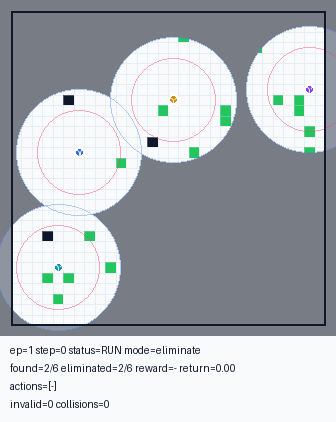
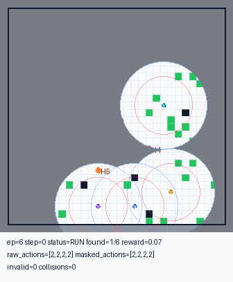
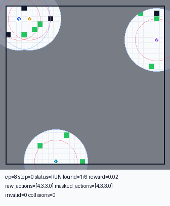
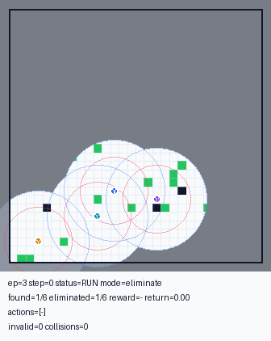

# MiniUAV-VLA: Vision-Language Action Model for Cooperative Multi-UAV Tasks

This repository contains the source code for the paper:

> **MiniUAV-VLA: A Lightweight Vision-Language Action Model for Cooperative Multi-UAV Elimination Tasks**

---

## Overview

MiniUAV-VLA integrates a lightweight Vision-Language Model (VLM) with multi-agent reinforcement learning (MARL) to enable cooperative drone control. The key pipeline is:

1. **Train a QMIX expert** on the custom multi-UAV drone environment.
2. **Collect expert rollouts** and convert them into a VLA dataset (image + language prompt → joint action).
3. **Fine-tune the VLM** (Supervised Fine-Tuning, SFT) on the collected dataset.
4. **Evaluate closed-loop**: the fine-tuned VLM drives all drones in real-time.

The drone environment features a configurable grid-world with obstacles, mobile humans (targets), and multiple drones with limited view ranges and attack ranges.

---

## Repository Structure

```
.
├── src/                        # MARL training framework (based on EPyMARL)
│   ├── main.py                 # Training entry point
│   ├── run.py                  # Run logic
│   ├── config/
│   │   ├── default.yaml        # Default hyperparameters
│   │   ├── algs/               # Algorithm configs (qmix, mappo, etc.)
│   │   └── envs/
│   │       └── drones.yaml     # Drone environment config
│   ├── envs/
│   │   ├── env_Drones/         # Custom multi-UAV environment
│   │   │   └── env_Drones.py
│   │   └── drones_wrapper.py   # EPyMARL wrapper for the drone env
│   ├── modules/                # Agent networks, mixers, critics
│   ├── learners/               # QMIX, MAPPO, COMA, etc.
│   ├── controllers/            # Multi-agent controllers
│   ├── runners/                # Episode and parallel runners
│   └── components/             # Replay buffers, action selectors
│
├── VLA/                        # VLA pipeline (core contribution)
│   ├── close_loop_drones_evaluation.py   # Closed-loop eval entry point
│   ├── envs/
│   │   ├── drones_adapter.py             # Prompt builder & image renderer
│   │   ├── drones_dataset.py             # PyTorch Dataset for VLA training
│   │   ├── drones_model_wrapper.py       # VLM + MultiDroneActionHead
│   │   ├── generate_drones_qmix_dataset.py  # Collect QMIX rollouts → dataset
│   │   ├── generate_drones_dataset.py    # (greedy/random baseline dataset)
│   │   └── render_drones_qmix_rollouts.py   # Render rollout videos
│   └── SFT/
│       ├── train_drones_sft.py           # SFT training script
│       └── evaluate_drones.py            # In-training evaluation helper
│
├── minimind-v/                 # NOT included — clone separately (see Installation)
│
├── assets/                     # Demo GIFs shown in this README
├── runuav_qmix_eliminate_v4a4.sh   # Main QMIX training script (paper setting)
├── runuav.sh                       # General QMIX training sweep
├── train.sh                        # Baseline algorithm sweep
├── plot_results.py                 # Plot sacred/JSON experiment logs
├── requirements.txt
├── env_requirements.txt
├── LICENSE
└── NOTICE
```

---

## Installation

### 1. Clone this repository and install dependencies

```bash
git clone <this-repo>
cd MiniUAV-VLA
pip install -r requirements.txt
```

### 2. Clone the VLM backbone (minimind-v)

The VLA pipeline depends on the MiniMind-V backbone. Clone it into the project root:

```bash
git clone https://github.com/jingyaogong/minimind-v.git
```

The directory must be named `minimind-v` and placed at the project root so that `VLA/envs/drones_model_wrapper.py` can locate it automatically.

### 3. Download the vision encoder

The VLM uses **SigLIP2-base-patch16-224** as the visual encoder. Download it from HuggingFace and place it at `model/siglip2-base-p16-224/`:

```bash
mkdir -p model
# Option A: huggingface-cli
huggingface-cli download google/siglip2-base-patch16-224 --local-dir model/siglip2-base-p16-224

# Option B: git lfs
git clone https://huggingface.co/google/siglip2-base-patch16-224 model/siglip2-base-p16-224
```

### 4. Fine-tuned VLA weights

Train your own model by following the [Step-by-Step Workflow](#step-by-step-workflow) below: Steps 1–3 produce the checkpoint `VLA/models/sft_vlm_drones_qmix_5k_promptpos_768.pth`, which is then used for closed-loop evaluation in Step 4.

---

## Step-by-Step Workflow

### Step 1 — Train QMIX expert

The paper's main setting: 4 drones, 6 humans, 30×30 map, eliminate mission (view\_range=4, attack\_range=4).

```bash
bash runuav_qmix_eliminate_v4a4.sh
```

Key overrides:
```bash
GPU_ID=0 SEEDS="0 1 2" T_MAX=2050000 bash runuav_qmix_eliminate_v4a4.sh
```

The trained checkpoint is saved under `results/models/qmix_seed0_drones_<timestamp>/`.

### Step 2 — Generate VLA dataset from QMIX rollouts

```bash
python VLA/envs/generate_drones_qmix_dataset.py \
    --checkpoint-path results/models/qmix_seed0_drones_<timestamp> \
    --out-dir VLA/data/drones_qmix_elim_v4a4_5k \
    --n-episodes 5000 \
    --map-size 30 --drone-num 4 --human-num 6 \
    --view-range 4 --attack-range 4 \
    --mission-mode eliminate
```

This produces a JSON-based dataset where each record contains the rendered bird's-eye image, a language prompt describing each drone's observation, and the joint expert action.

### Step 3 — Fine-tune the VLM (SFT)

```bash
python VLA/SFT/train_drones_sft.py \
    --data-dir VLA/data/drones_qmix_elim_v4a4_5k \
    --pretrained out/pretrain_vlm_768.pth \
    --save-path VLA/models/sft_vlm_drones_qmix_5k_promptpos_768.pth \
    --epochs 10 \
    --batch-size 8 \
    --vision-model model/siglip2-base-p16-224 \
    --image_token_len 196
```

> Note: `out/pretrain_vlm_768.pth` is the MiniMind-V pre-trained base weight. It can be obtained from the [MiniMind-V](https://github.com/jingyaogong/minimind-v) repository.

### Step 4 — Closed-loop evaluation

```bash
python VLA/close_loop_drones_evaluation.py \
    --checkpoint VLA/models/sft_vlm_drones_qmix_5k_promptpos_768.pth \
    --vision-model model/siglip2-base-p16-224 \
    --image_token_len 196 \
    --map-size 30 --drone-num 4 --human-num 6 \
    --view-range 4 --attack-range 4 \
    --mission-mode eliminate \
    --n-episodes 100
```

---

## Environment Details

The custom drone environment (`src/envs/env_Drones/env_Drones.py`) is a grid-world multi-agent environment with:

- **Agents**: drones with configurable view range and attack range.
- **Targets**: mobile humans that move stochastically (random walk / stay).
- **Obstacles**: walls and trees that block movement and line-of-sight.
- **Mission modes**: `search` (discover all humans) and `eliminate` (discover and eliminate all humans).
- **Observation**: each drone observes its local view (nearest humans, obstacles, teammates).
- **Actions**: 5 discrete actions — UP, DOWN, LEFT, RIGHT, STAY.

The environment is registered with the EPyMARL framework via `src/envs/drones_wrapper.py` and configured via `src/config/envs/drones.yaml`.

---

## Demo

Closed-loop rollouts of MiniUAV-VLA driving all 4 drones (4 drones vs 6 targets mission).

### ✅ Successful episodes

<table>
<tr>
<td align="center"><br/><sub>All 6 targets eliminated</sub></td>
<td align="center"><br/><sub>All 6 targets eliminated</sub></td>
</tr>
</table>

### ❌ Failure cases

<table>
<tr>
<td align="center"><br/><sub>1 target left undiscovered (timeout)</sub></td>
<td align="center"><br/><sub>2 targets left undiscovered (timeout)</sub></td>
</tr>
</table>

---

## Model Architecture

```
MiniMindVLMWithDroneActions
├── vlm: MiniMindVLM
│   ├── vision_encoder: SigLIP2-base-p16-224 (frozen during SFT)
│   ├── vision_proj: linear projection (768 → hidden_size)
│   └── model: MiniMind LLM (transformer, 768-dim, optionally MoE)
└── action_head: MultiDroneActionHead
    └── Linear(hidden_size → n_agents × n_actions)
```

The model takes a rendered top-down image and a natural language prompt (one sentence per drone describing its local observation) and outputs joint discrete actions for all drones simultaneously.

---

## Baselines

The MARL baselines (QMIX, MAPPO, VDN, COMA, MADDPG, etc.) can be run via the EPyMARL framework:

```bash
# QMIX
python src/main.py --config=qmix --env-config=drones \
    with env_args.map_size=30 env_args.drone_num=4 env_args.human_num=6 \
    env_args.view_range=4 env_args.attack_range=4 env_args.mission_mode=eliminate

# MAPPO
python src/main.py --config=mappo --env-config=drones \
    with env_args.map_size=30 env_args.drone_num=4 env_args.human_num=6 \
    env_args.view_range=4 env_args.attack_range=4 env_args.mission_mode=eliminate
```

---

## Acknowledgements

The MARL training framework is based on [EPyMARL](https://github.com/uoe-agents/epymarl) (Apache 2.0).
The VLM backbone is based on [MiniMind-V](https://github.com/jingyaogong/minimind-v) (Apache 2.0).
The vision encoder uses [SigLIP2](https://huggingface.co/google/siglip2-base-patch16-224) from Google.

---

## License

This project is licensed under the Apache License 2.0 — see [LICENSE](LICENSE) for details.
